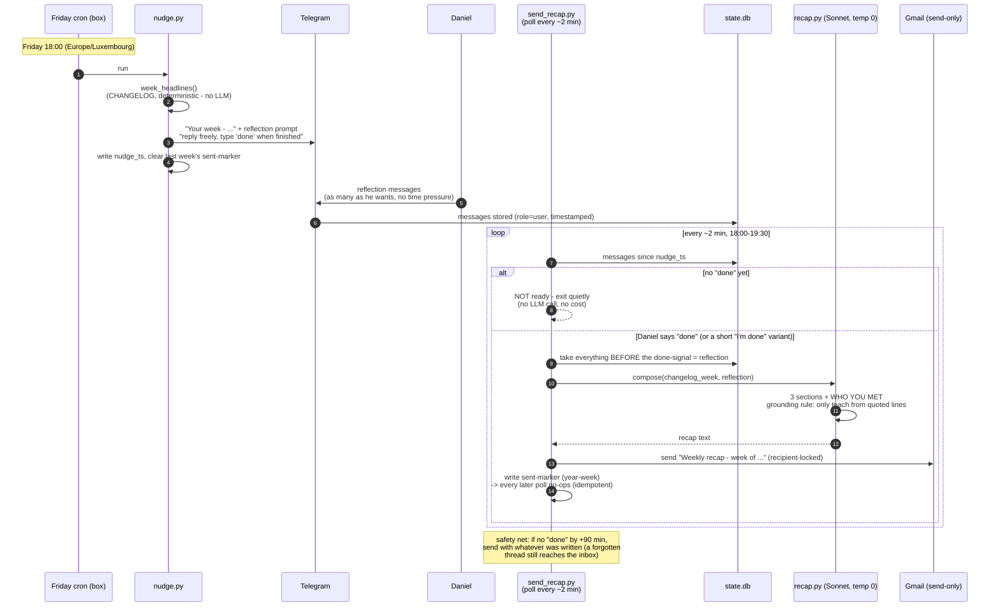

# Weekly recap - how a normal Friday runs

The intended weekly flow (built + live-tested 2026-07-18, "done"-gate design).
Three tools, all deterministic except the one compose call: `tools/nudge.py`, `tools/send_recap.py`, `tools/recap.py`.



## The three guards that make it safe

| Guard | Mechanism | Why |
|---|---|---|
| Human-in-the-loop gate | waits for a literal "done" from Daniel | the 07-18 live test fired mid-thread on a fixed timer and cut his reflection off |
| Idempotency | sent-marker `%Y-W%V`; polls no-op after one send | a 2-min poll can never double-send |
| Cutoff fallback | 90 min after nudge, send what exists | forgetting "done" degrades to the old behavior, not silence |

## Status - WIRED 2026-07-24 (first automatic run: tonight)

- Agent code: built, deployed on the box, live-tested end-to-end 2026-07-18 (gate held 10 min, sent once, then no-oped).
- Cron wired 2026-07-24, ship gate green: `weekly-recap-nudge.timer` (Fri 18:00 CEST) + `weekly-recap-poll.timer` (Fri 18:03-19:59, every 2 min).
- Race fixed at wiring time: the poll starts at 18:03 (after the nudge writes `nudge_ts`), AND `send_recap.py` refuses any `nudge_ts` older than 12h - so a poll can never compose off a previous week's nudge and fire early.
```
