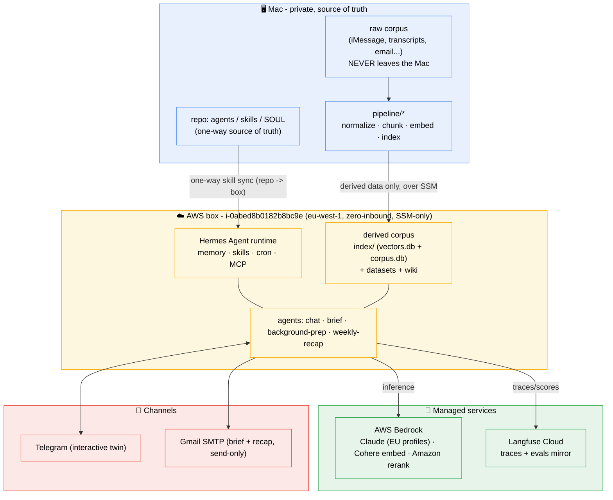
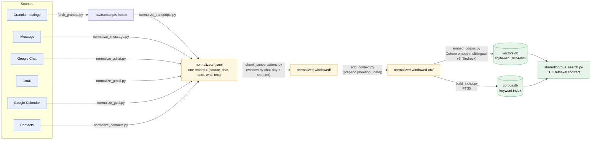
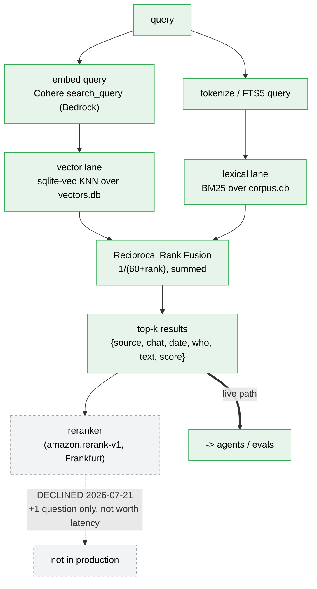
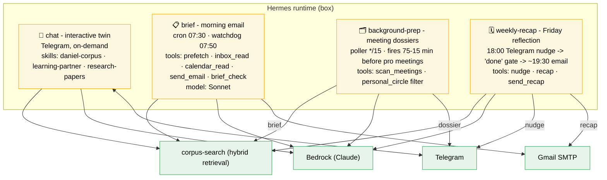
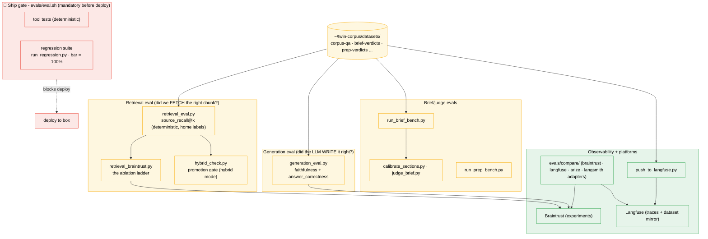
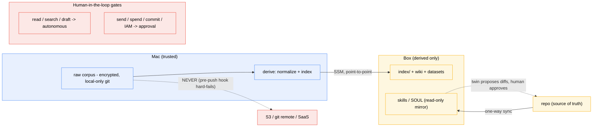

 # Twin Mind - Architecture Map

A full visual map of the system: where data lives, how the corpus becomes retrievable, the agents that run, the eval gates, and the governance rules.
View this in Zed, GitHub, or a Mermaid live editor to render the diagrams.

Ground truths this reflects: `CLAUDE.md`, `docs/2026-06-30-twin-mind-design.md`, `docs/2026-07-17-corpus-chunking-design.md`, `docs/CHANGELOG.md`.

---

## 1. System at a glance

Where the three worlds sit - the Mac (raw data + prep), the AWS box (the always-on twin), and the channels Daniel touches.

---

## 2. The RAG data pipeline (raw → retrievable)

How a message or meeting becomes something the twin can search.
This is the pipeline the 2026-07-21 work upgraded: windowed chunking + contextual embedding, promoted to production on both lanes.

---

## 3. Inside the retriever (hybrid search)

What `corpus-search` actually does for one query. Default mode = hybrid.
The reranker rung was **built and measured but declined** (marginal gain), so it is not in the live path.

---

## 4. The agents (what runs, when)

Four agents on the Hermes runtime, each a folder under `agents/`. All read the corpus through `corpus-search`; all inference via Bedrock.

---

## 5. The eval stack

Nothing ships without the gate. Retrieval and generation are measured separately (RAGAS split); everything mirrors to Langfuse.

---

## 6. Governance and data flow (the rules that constrain everything)

The non-negotiables: raw data never leaves the Mac, the box never self-edits, humans approve anything irreversible.

---

## Legend / key facts

| Thing | Value |
|---|---|
| Box | EC2 `i-0abed8b0182b8bc9e`, t4g.small, eu-west-1, zero-inbound, SSM-only, role `twin-mind-role` |
| Agent framework | Hermes (Nous Research) - memory, skills, cron, MCP |
| Inference | Bedrock: Claude EU profiles (Sonnet drafting / Haiku triage), Cohere embed-multilingual-v3, Amazon rerank (eu-central-1) |
| Retrieval | Hybrid (FTS5 + sqlite-vec + RRF) via `corpus-search`; windowed + contextual chunks (promoted 2026-07-21) |
| Observability | Langfuse Cloud (free tier); Braintrust for experiments |
| Channels | Telegram Bot API (interactive), Gmail SMTP (brief + recap, send-only, recipient-locked) |
| Hard rules | raw stays on Mac · one-way skill sync · ship gate green before deploy · approval for send/spend/irreversible |
