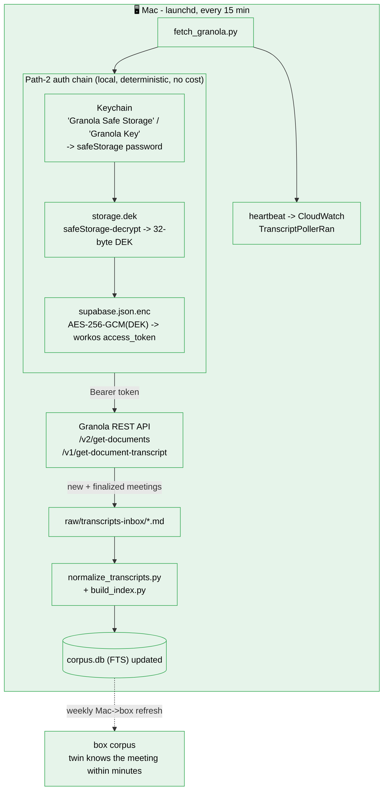
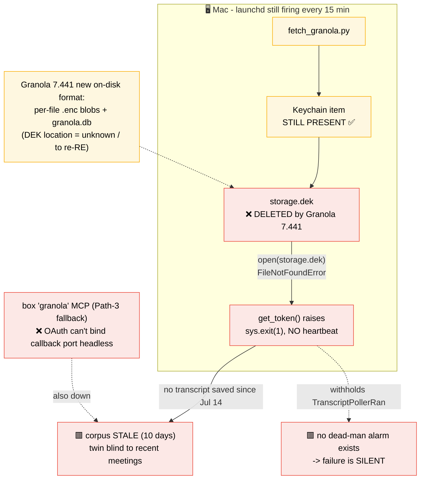

# Granola ingestion - failure diagnosis (2026-07-24)

**Symptom:** no new meeting transcripts in the corpus since **July 14** (10 days). The Mac launchd poller
`fetch_granola.py` is loaded but exits code 1 every run; `TranscriptPollerRan` has no CloudWatch datapoints.

**Root cause:** Granola auto-updated **7.394.3 → 7.441.4** and **removed `storage.dek`**, replacing the old
two-layer local-decrypt scheme with per-file `.enc` blobs + a new `granola.db`. The poller's Path-2 chain
reads `storage.dek` (line 94) → `FileNotFoundError` → `get_token()` raises → the "SCREAM" branch → `sys.exit(1)`.

**Why it was silent for 10 days:** there is **no dead-man alarm on `TranscriptPollerRan`** (only brief / prep /
watchdog have one). The poller "screams" by withholding its heartbeat, but nothing was watching that metric.

This is the **2nd break in 2 months** (the plaintext-token trick died in May; the DEK-file trick died now).
Local-storage decryption is fragile by nature because Granola changes its on-disk format on updates.

---

## What is SUPPOSED to happen (the intended architecture)

---

## What is ACTUALLY happening (broken since Granola 7.441)

---

## Fix options (next step - decision needed)

| Option | What | Robustness |
|---|---|---|
| **A. Re-RE the 7.441 format** | find where the DEK now lives, patch the chain | fragile - breaks again next Granola update (this is break #2) |
| **B. Read `granola.db` directly** | if transcripts live in the local SQLite, skip the token entirely | robust IF the data is there and not `.enc`-only - needs checking |
| **C. Official Granola API / OAuth once** | a real token path, not local-decrypt | most robust; depends on Granola offering it |
| **D. Box MCP (Path 3)** | fix the headless OAuth (persist a refreshed token) | medium; MCP OAuth is the thing already failing |

**Plus (independent of which): add a `TranscriptPollerRan` dead-man alarm** so the next break screams instead of rotting silently for 10 days.

**Recommendation:** don't just re-patch Path 2 (option A) - it will break on the next Granola update. Check option B first (is the transcript text sitting in `granola.db`?); if not, go to C. And add the alarm regardless.

---

## RESOLUTION (2026-07-24) - option 1 chosen and shipped

Probes killed both verbatim paths: `granola.db` and every local file are now encrypted (no key file), and the official MCP gates `get_meeting_transcript` behind a paid tier.
Daniel's ruling: ingest the official MCP's AI **summaries** instead - free, robust, survives app updates.

Root cause of the MCP-token deaths found too: the Mac and box shared ONE OAuth client + refresh-token family (cloned on migration day), and refresh tokens rotate - two consumers invalidate each other.
**Rule: the box is the single owner of the Granola MCP token; never use granola from Mac-side Hermes.**

Shipped:
- One-time `hermes mcp login granola` on the Mac (browser OAuth), fresh token copied to the box, gateway restarted.
  The brief's every-morning granola OAuth crash-loop is gone.
- `pipeline/ingest_meeting_summaries.py` - box-side ingester: direct MCP JSON-RPC client (self-refreshing token, atomic write-back to the shared token file), baseline-marked the 13 existing meetings, ingests only NEW ones.
  INCREMENTAL inserts into the live corpus.db + vectors.db with the contextual `[title . date]` prefix - never a rebuild (the box's normalized/ is pre-promotion; a rebuild would revert windowed+contextual).
  Md copies land in `~/twin-corpus/summaries-inbox/` for the Mac refresh to merge.
- `summary-ingest.timer` every 4h (00:15, 04:15, ...), persistent.
- `twin-mind-summary-ingest-deadman` CloudWatch alarm (12h without a heartbeat -> ALARM -> twin-mind-alerts SNS) - the alarm the old poller never had.
- Old Mac launchd poller unloaded (`launchctl bootout`); re-enable with `launchctl bootstrap gui/$UID ~/Library/LaunchAgents/com.twinmind.granola-transcript-poller.plist` if ever needed.

Trade-off accepted: summaries, not verbatim.
If verbatim matters later, the paid Granola tier reopens it cleanly (official `get_meeting_transcript`).
